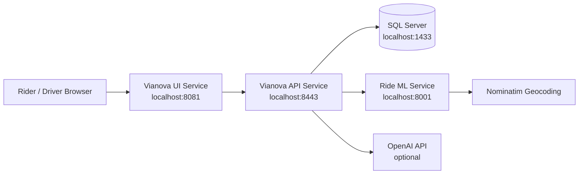

# Vianova High-Level Solution Design

## 1. Document Overview

This High-Level Solution Design describes the current Vianova project architecture across the ML service, UI service, and API service. It is based on the repository structure and implementation present in this codebase.

## 2. Solution Summary

Vianova is a ride-booking application prototype with rider, driver, ride, payment-card, fare-estimation, trip-tracking, feedback, and chatbot workflows.

The solution is split into three main runtime services:

| Service | Location | Runtime | Purpose |
| --- | --- | --- | --- |
| UI Service | `vianova-ui` | Spring Boot, static HTML/CSS/JS, React UMD | Hosts rider/driver pages and proxies browser calls to the API |
| API Service | `vianova-api` | Spring Boot REST, JDBC | Owns business workflows, persistence, chatbot orchestration, and ML integration |
| ML Service | `ml/ride-ml-service` | FastAPI, Python models | Predicts ride fare, ETA, tolls, and total estimated cost |

## 3. Logical Architecture

## 4. Component Design

### 4.1 UI Service

The UI service serves the browser application and acts as a backend-for-frontend proxy.

**Responsibilities**

- Serve `index.html`, `rider.html`, and `driver.html`.
- Serve static assets under `static/css`, `static/js`, and `static/images`.
- Render rider, driver, shared, and chatbot UI modules in browser-side React.
- Proxy browser calls from `/api/...` to the API service.
- Forward JSON and multipart driver-onboarding requests.

**Important files**

- `vianova-ui/src/main/java/com/example/vianovaui/HelloProxyController.java`
- `vianova-ui/src/main/resources/static/js/modules/rider-components.js`
- `vianova-ui/src/main/resources/static/js/modules/driver-components.js`
- `vianova-ui/src/main/resources/static/js/modules/chatbot-components.js`
- `vianova-ui/src/main/resources/static/css/styles.css`

### 4.2 API Service

The API service owns application logic and database access.

**Responsibilities**

- Rider onboarding, login, profile, saved cards, and ride history.
- Driver onboarding, login, profile, registered cars, ratings, and ride history.
- Ride estimate, ride request, acceptance, negotiation, finalization, completion, and feedback workflows.
- ML-service integration with local fallback estimates.
- Chatbot handling through OpenAI tool calling when configured, with deterministic local fallback.
- SQL Server schema initialization through resource SQL files.

**Important files**

- `AuthController.java`
- `RiderOnboardingController.java`
- `RiderProfileController.java`
- `DriverOnboardingController.java`
- `DriverDashboardController.java`
- `RideEstimateController.java`
- `RideMlEstimatorService.java`
- `ChatbotController.java`
- `TravelChatService.java`
- `OpenAiToolCallingService.java`

### 4.3 ML Service

The ML service provides model-backed inference for ride estimates.

**Responsibilities**

- Load ETA, fare, and toll model artifacts.
- Expose health and prediction endpoints.
- Geocode source and destination addresses.
- Map coordinates to NYC taxi zone IDs.
- Calculate approximate trip distance.
- Return ETA, fare, tolls, total estimate, and model version.

**Important files**

- `ml/ride-ml-service/ml_inference_service.py`
- `ml/ride-ml-service/eta_model_xgb.pkl`
- `ml/ride-ml-service/fare_model_xgb.pkl`
- `ml/ride-ml-service/tolls_model_xgb.pkl`
- `ml/taxizones/taxi_zones.shp`

## 5. Key Functional Flows

### 5.1 Rider Onboarding and Login

1. Rider submits onboarding details from the UI.
2. UI calls `/api/riders/onboard`.
3. UI service forwards to API `/riders/onboard`.
4. API stores rider profile in SQL Server.
5. Rider logs in through `/auth/rider/login`.
6. UI stores returned rider identity for later rider workflows.

### 5.2 Driver Onboarding and Login

1. Driver submits personal details and license document.
2. UI calls `/api/drivers/onboard` using multipart form data.
3. API stores driver profile and license document in SQL Server.
4. Driver logs in through `/auth/driver/login`.
5. Driver dashboard loads cars, ride requests, ratings, profile, and previous rides.

### 5.3 Ride Estimate

1. Rider enters source, destination, and departure time.
2. UI calls `/api/rides/estimate`.
3. API calls `RideMlEstimatorService`.
4. API sends address payload to ML `/ml/v1/predict-addresses`.
5. ML geocodes addresses, resolves taxi zones, runs models, and returns prediction.
6. API returns estimated fare, ETA, currency, available drivers, model version, and fallback flag.
7. If ML is disabled or unavailable, API returns a fallback estimate.

### 5.4 Ride Request and Fare Negotiation

1. Rider creates a request through `/rides/requests`.
2. API stores the request as `PENDING_DRIVER`.
3. Driver dashboard fetches available ride requests.
4. Driver accepts a request.
5. Rider and driver exchange fare offers through negotiation endpoints.
6. Both parties accept the final fare.
7. Rider finalizes the trip and receives a trip ID and trip PIN.

### 5.5 Trip Completion and Feedback

1. UI tracks a trip using `/rides/tracking`.
2. Rider completes the trip using trip ID and PIN.
3. API stores completed ride details for driver history.
4. Rider submits rating, tip, and comment.
5. API updates trip feedback, rating summary, and rating strengths.

### 5.6 Chatbot

1. Browser chatbot posts to `/api/chatbot/message`.
2. UI service forwards to `/chatbot/message`.
3. API attempts OpenAI tool calling if configured.
4. Supported tools fetch ride estimates, trip status, rider history, saved cards, payment options, driver cars, driver ratings, and driver rides.
5. If OpenAI is unavailable or unconfigured, the deterministic router handles supported intents.

## 6. API Surface

### UI Proxy Endpoints

The browser calls `/api/...` endpoints exposed by `HelloProxyController`. These proxy to the API service and shield the browser from direct backend-service URL management.

### API Service Endpoints

**Authentication**

- `POST /auth/rider/login`
- `POST /auth/driver/login`
- `POST /auth/rider/logout`
- `POST /auth/driver/logout`

**Rider**

- `POST /riders/onboard`
- `GET /riders/profile`
- `POST /riders/profile/address`
- `POST /riders/profile/payment`
- `GET /riders/cards`
- `POST /riders/cards/save`
- `POST /riders/cards/delete`
- `GET /riders/rides`

**Driver**

- `POST /drivers/onboard`
- `GET /drivers/profile`
- `POST /drivers/profile/address`
- `POST /drivers/profile/payment`
- `POST /drivers/contact/update`
- `GET /drivers/cars`
- `POST /drivers/cars`
- `POST /drivers/cars/delete`
- `GET /drivers/rides`
- `GET /drivers/ride-requests`
- `POST /drivers/ride-requests/accept`
- `POST /drivers/ride-requests/negotiate`
- `POST /drivers/ride-requests/accept-final`
- `GET /drivers/ratings`

**Ride**

- `POST /rides/estimate`
- `POST /rides/options`
- `POST /rides/requests`
- `GET /rides/requests/status`
- `POST /rides/negotiate`
- `POST /rides/requests/accept-final`
- `POST /rides/tracking-preview`
- `POST /rides/finalize`
- `GET /rides/tracking`
- `POST /rides/complete`
- `POST /rides/feedback`

**Chatbot**

- `POST /chatbot/message`

**ML**

- `GET /health`
- `POST /ml/v1/predict`
- `POST /ml/v1/predict-addresses`

## 7. Data Design

### SQL Server Tables

**Rider tables**

- `rider_onboarding`
- `rider_saved_cards`
- `ride_requests`

**Driver tables**

- `driver_onboarding`
- `driver_previous_rides`
- `driver_rating_summary`
- `driver_rating_strength`
- `driver_cars`
- `driver_contact_info`
- `driver_trip_feedback`

### Persistence Notes

- Rider, driver, ride-request, card, car, completed-ride, and feedback data are persisted in SQL Server.
- Trip tracking, trip PIN, and trip metadata are currently stored in API-service memory. This is suitable only for a single local instance and is lost on restart.
- ML model artifacts and taxi-zone shapefiles are local filesystem dependencies of the ML service.

## 8. Configuration and Runtime

| Component | Default Port | Configuration |
| --- | ---: | --- |
| UI Service | `8081` | `vianova-ui/src/main/resources/application.properties` |
| API Service | `8443` | `vianova-api/src/main/resources/application.properties` |
| ML Service | `8001` | Python command-line startup and local model files |
| SQL Server | `1433` | External local SQL Server |

**Important API properties**

- `server.port`
- `server.ssl.*`
- `spring.datasource.*`
- `openai.api.key`
- `openai.base-url`
- `openai.chat.model`
- `ml.service.enabled`
- `ml.service.base-url`

**Important UI properties**

- `server.port`
- `vianova.api.base-url`

## 9. Non-Functional Design

### Availability

- API ride estimation continues with fallback logic if the ML service is unavailable.
- Chatbot continues with deterministic routing if OpenAI is unavailable or unconfigured.
- SQL Server is required for login, onboarding, profiles, ride requests, cards, feedback, and driver history.

### Scalability

- UI service is mostly stateless and can be replicated.
- API service can be replicated after in-memory trip state is moved to shared storage.
- ML service can be scaled independently for prediction workloads.
- Geocoding latency and rate limits can affect ML prediction response time.

### Security

- API uses HTTPS locally.
- Passwords are hashed.
- Saved cards store card metadata and last four digits only.
- Driver license documents are stored in SQL Server as binary content.
- Secrets such as OpenAI keys, database credentials, and keystore passwords should be externalized and removed from committed configuration files.

### Observability

- API logs ride-estimate flow IDs, ML integration results, chatbot routing, and tool-calling behavior.
- ML logs health checks, geocoding, zone mapping, and model prediction outputs.
- Current logging is file-based through local `.out.log` and `.err.log` files.

## 10. Current Risks and Recommended Improvements

| Area | Current Risk | Recommendation |
| --- | --- | --- |
| UI-to-API URL | UI config points to `http://localhost:8080`, while README/API config indicate API runs on HTTPS `8443` | Align `vianova.api.base-url` with the actual API runtime URL |
| Secrets | API key and database credentials are present in application properties | Move secrets to environment variables or a secrets manager |
| Trip state | Trip tracking data is in memory | Persist trip state in SQL Server or a shared cache |
| Authentication | UI passes user IDs directly after login | Add token/session-based authentication and authorization |
| Database migrations | SQL init runs from schema files | Adopt Flyway or Liquibase for controlled migrations |
| Geocoding dependency | ML service depends on external Nominatim calls | Add caching, retries, and production geocoding provider strategy |
| File storage | License documents are stored in SQL Server | Consider object storage with metadata in SQL Server |

## 11. Target Production Direction

For production, keep the current service separation but harden deployment:

- Put UI and API behind a reverse proxy or API gateway.
- Serve static assets through CDN or web tier caching.
- Use managed SQL Server with migration tooling.
- Move trip tracking state to SQL Server or Redis.
- Store uploaded documents in object storage.
- Externalize secrets.
- Add authentication tokens, authorization checks, CSRF protection, and request auditing.
- Containerize UI, API, and ML services.
- Add health checks and centralized logs/metrics.
- Add API contract tests and ML prediction contract tests.
